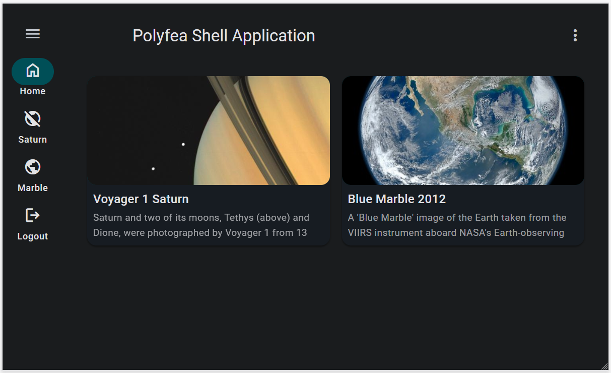

# Polyfea MD Shell Deployment

The base folder contains the fundamental configuration for deploying the Polyfea MD Shell on a Kubernetes cluster that operates with the [Polyfea Controller](https://github.com/polyfea/polyfea-controller). This configuration is designed for the default [`MicrofrontendClass`](https://github.com/polyfea/polyfea-controller/blob/main/api/v1alpha1/microfrontendclass_types.go). To apply it to a different class, follow the steps below and add the following replacements to your kustomization file:

```yaml
resources:
- https://github.com/polyfea/md-shell//deploy/manifests/base?version=v1.0.1

patches:
- patch: |-
    - op: replace
      path: /spec/frontendClass
      value: wac-hospital
  target:
     kind: MicroFrontend
```

## Sample Applications

The folder `with-sample-apps` includes some sample top-level tiles. If you want to see tile images, remember to add `img-src https://live.staticflickr.com` to the `spec.cspHeader` property of your `MicrofrontendClass`.

Once you have applied the provided manifests, you will be able to see applications in the shell:



