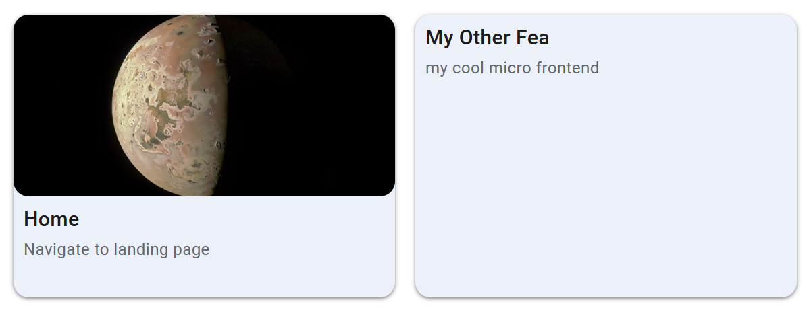

# polyfea-md-app

Application tile or icon for the Polyfea MD Shell. Support various variants of rendering depending on the context area in which it's rendered. For example, the tile variant is used in the main content area, while the icon variant is used in the navigation, rail, and drawer areas.

Intended to be used as definition in the polyfea controller CRDs resource WebComponent. See the [polyfea controller](https://github.com/polyfea/polyfea-controller) for more details.

Can be used also in standalone mode as part of the [polyfea-md-shell](../polyfea-md-shell/readme.md) component.

## How to use

### Using the polyfea controller

Here's an example  [Webcomponent CRD](https://github.com/polyfea/polyfea-controller/blob/main/config/crd/bases/polyfea.github.io_webcomponents.yaml) resources that need to be loaded in the context area "tool-applications":

```yaml
apiVersion: polyfea.github.io/v1alpha1
kind: Webcomponent
metadata:
    name: sample-tool
spec:
    element: polyfea-md-app
    attributes:
        - name: headline
        value: Sample tool
        - name: supporting-text
        value: This is a sample tool
        - name: material-icon
        value: plumbing
        - name: href
        value: path/to/sample/tool/page
    microfrontend: tools-fea
    display-rules:
        - anyOf:
            - context-name: tool-applications
```

### Standalone

Import [@material/web](https://github.com/material-components/material-web#readme) and [theme tokens](https://m3.material.io/foundations/design-tokens/overview). For more details, refer to the examples in [polyfea-md-shell](../polyfea-md-shell/readme.md) documentation.

Import the component in your module:

```typescript
import '@polyfea/md-shell';
```

then place the element in your HTML.

```html
  <div style="display: flex; gap: 1rem; margin: 1rem;">
    <polyfea-md-app href="./" headline="Home" supporting-text="Navigate to landing page" material-icon="home"
      context="main-content" tile-img-src="https://images-assets.nasa.gov/image/PIA26234/PIA26234~orig.jpg">
    </polyfea-md-app>

    <polyfea-md-app href="./" headline="My Other Fea" supporting-text="my cool micro frontend" material-icon="home"
      context="main-content" disable-tile-img>
    </polyfea-md-app>
  </div>
```

This will render folowing content:



Additional examples can be found in the description of the elements [polyfea-md-drawer](../polyfea-md-drawer/readme.md), [polyfea-md-rail](../polyfea-md-rail/readme.md), and [polyfea-md-navigation](../polyfea-md-navigation/readme.md).

## Specifications

<!-- Auto Generated Below -->


## Properties

| Property          | Attribute           | Description                                                                                                                                                                                                                                                                                                                                                                                                               | Type      | Default     |
| ----------------- | ------------------- | ------------------------------------------------------------------------------------------------------------------------------------------------------------------------------------------------------------------------------------------------------------------------------------------------------------------------------------------------------------------------------------------------------------------------- | --------- | ----------- |
| `context`         | `context`           | /** This property specifies the context in which the element is rendered.  It's typically set by the `polyfea-context` element. For more details, refer to the [`polyfea-context` documentation](https://github.com/polyfea/core/blob/main/src/components/polyfea-context/readme.md).                                                                                                                                     | `string`  | `undefined` |
| `headline`        | `headline`          | The main title of the application.                                                                                                                                                                                                                                                                                                                                                                                        | `string`  | `undefined` |
| `href`            | `href`              | This property specifies the URL to navigate to when the element is clicked.  The click handler uses either the Navigation API's `navigate()` method or the History API's `pushState()` method. For more details, refer to the [Navigation API](https://developer.mozilla.org/en-US/docs/Web/API/Navigation/navigate) and [History API](https://developer.mozilla.org/en-US/docs/Web/API/History/pushState) documentation. | `string`  | `undefined` |
| `iconSrc`         | `icon-src`          | The URL of the image to display in the drawer, rail, or navigation variant rendering.                                                                                                                                                                                                                                                                                                                                     | `string`  | `undefined` |
| `isActivePrefix`  | `is-active-prefix`  | This property specifies whether the element is actived on all paths prefixed by href. By default, the element is only active when the href matches the current path.                                                                                                                                                                                                                                                      | `boolean` | `false`     |
| `materialIcon`    | `material-icon`     | This property specifies the name of the Material Symbol icon to be used.  It's only utilized if the `icon-src` property is not set.  For more details on Material Symbols, refer to the [Material Symbols documentation](https://fonts.google.com/icons).                                                                                                                                                                 | `string`  | `undefined` |
| `shortHeadline`   | `short-headline`    | A shorter version of the headline, used in drawer, rail, or navigation variant rendering.                                                                                                                                                                                                                                                                                                                                 | `string`  | `undefined` |
| `supportingText`  | `supporting-text`   | Additional text to display in the tile variant rendering.                                                                                                                                                                                                                                                                                                                                                                 | `string`  | `undefined` |
| `tileImgDisabled` | `tile-img-disabled` | This property disables the image in the tile variant rendering. If the `tile-img-src` property is not specified, the colored content is used instead.  When the tile image is disabled, only the `headline` and `supporting-text` properties are rendered.                                                                                                                                                                | `boolean` | `false`     |
| `tileImgSrc`      | `tile-img-src`      | The URL of the image to display in the tile variant rendering.                                                                                                                                                                                                                                                                                                                                                            | `string`  | `undefined` |


## Slots

| Slot     | Description                                                                                                                             |
| -------- | --------------------------------------------------------------------------------------------------------------------------------------- |
| `"icon"` | icon to replace the icon shown in navigation, rail, and drawer variants. Takes priority over `icon-src` and `material-icon` properties. |


## CSS Custom Properties

| Name                                   | Description                                                                                                                                      |
| -------------------------------------- | ------------------------------------------------------------------------------------------------------------------------------------------------ |
| `--app-card-height`                    | Specifies the height of the tile card. Default value is `14rem`.                                                                                 |
| `--app-card-tile-img-background-color` | Specifies the background color of the tile image. Default value is `var(--md-sys-color-secondary-container, olive)`.                             |
| `--app-card-tile-img-fit`              | Specifies the `object-fit` style for the tile image. Default value is `cover`.                                                                   |
| `--app-card-tile-img-height`           | Specifies the height of the tile image. Default value is `9rem`.                                                                                 |
| `--app-card-width`                     | Specifies the width of the tile card. Default value is `16rem`. This may be affected by flex-grow in the context of the polyfea-md-apps element. |


----------------------------------------------

Polyfea MD Shell Web Components
