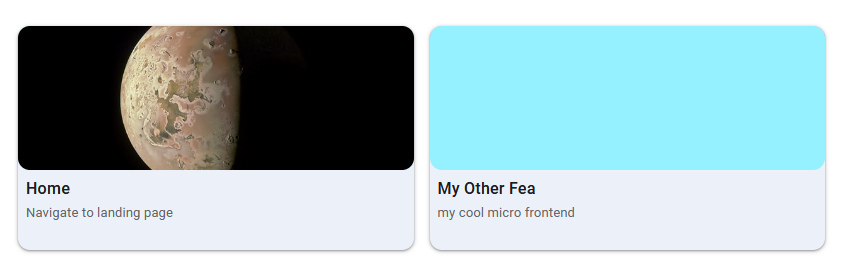

# polyfea-md-apps

This component displays microfrontends as navigable tiles, each with a name and description. It's typically used on the landing page or within subcontexts of a composite application to guide users to specific features. The component uses [polyfea-context](https://github.com/polyfea/core/blob/main/src/components/polyfea-context/readme.md) for content, but falls back to slot content if no context area is specified or available.

## How to use

### Using with polyfea controller

To use this component, add it to your microfrontend's template. Specify the name of the context area using the `applications-context` attribute.

```tsx
render() {
  return (
    <Host>
      <!--  other staff to render... -->
      <polyfea-md-apps applications-context="tool-applications"></polyfea-md-apps>
    </Host>
  );
}
```

For [Webcomponent CRD](https://github.com/polyfea/polyfea-controller/blob/main/config/crd/bases/polyfea.github.io_webcomponents.yaml) resources that need to be loaded in the context area, use the context name "tool-applications". Here's an example:

```yaml
apiVersion: polyfea.github.io/v1alpha1
kind: Webcomponent
metadata:
    name: sample-tool
spec:
    element: polyfea-md-app
    attributes:
        - name: headline
        value: Sample tool
        - name: supporting-text
        value: This is a sample tool
        - name: material-icon
        value: plumbing
        - name: href
        value: path/to/sample/tool/page
    microfrontend: tools-fea
    display-rules:
        - anyOf:
            - context-name: tool-applications
```

### Using as standalone component

Import [@material/web](https://github.com/material-components/material-web#readme) and [theme tokens](https://m3.material.io/foundations/design-tokens/overview). For more details, refer to the examples in [polyfea-md-shell](../polyfea-md-shell/readme.md) documentation.

Import the component in your module:

```typescript
import '@polyfea/md-shell';
```

then place the element in your HTML.

```html
<polyfea-md-apps>
    <polyfea-md-app href="./" headline="Home" supporting-text="Navigate to landing page" material-icon="home"
      context="main-content" tile-img-src="https://images-assets.nasa.gov/image/PIA26234/PIA26234~orig.jpg">
    </polyfea-md-app>

    <polyfea-md-app href="./" headline="My Other Fea" supporting-text="my cool micro frontend" material-icon="home"
      context="main-content" disable-tile-img>
    </polyfea-md-app>
</polyfea-md-app>
```

This will render folowing content:



## Specifications

## Context Areas

| Context Area Name      | Elements shown | Description |
| -------------------    | ------------------ |------------ |
| `"applications"` _Actual name depends on the value of the attribute `applications-context` | all | Use [`polyfea-md-app`](../polyfea-md-app/readme.md) or your own element for application tiles. Clicking a tile should navigate to the corresponding page. |

<!-- Auto Generated Below -->


## Overview

/**

## Properties

| Property              | Attribute              | Description                                                                                                                                                                            | Type     | Default          |
| --------------------- | ---------------------- | -------------------------------------------------------------------------------------------------------------------------------------------------------------------------------------- | -------- | ---------------- |
| `applicationsContext` | `applications-context` | name of the [polyfe-context](https://github.com/polyfea/core/blob/main/src/components/polyfea-context/readme.md)  element that will be used to render the applications web components. | `string` | `"applications"` |


## Slots

| Slot | Description                                                                                                                                                                                                                                                                                             |
| ---- | ------------------------------------------------------------------------------------------------------------------------------------------------------------------------------------------------------------------------------------------------------------------------------------------------------- |
|      | This slot is for the content of the element, typically application tiles.  You can use [polyfea-md-app](../polyfea-md-app/readme.md) or any other component.  If a context area is specified and available, the slot content is not rendered.  Instead, elements provided by the context are displayed. |


----------------------------------------------

Polyfea MD Shell Web Components
