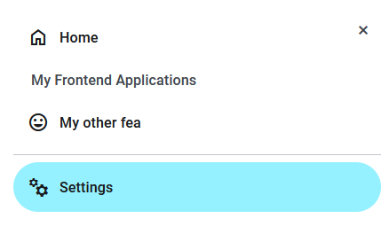

# polyfea-md-drawer-label

[Navigation Drawer](https://m3.material.io/components/navigation-drawer/overview) Label used to separate or group navigation links

## How to Use

This web component is built with [StencilJS](https://stenciljs.com/), making it compatible with any framework or even without one. It's designed to be used as part of the [`polyfea-md-shell`](../polyfea-md-shell/readme.md) component and in combination with [polyfea-md-app](../polyfea-md-app/readme.md) component.

Import [@material/web](https://github.com/material-components/material-web#readme) and [theme tokens](https://m3.material.io/foundations/design-tokens/overview). For more details, refer to the examples in [polyfea-md-shell](../polyfea-md-shell/readme.md) documentation.

Import the component in your module:

```typescript
import '@polyfea/md-shell';
```

then place the element in your HTML.

```html
<polyfea-md-drawer>
  <polyfea-md-app 
    href="./"
    headline="Home" supporting-text="Naviagte to landing page"
    material-icon="home" context="drawer-content"
  ></polyfea-md-app>
  <polyfea-md-drawer-label>My Frontend Applications</polyfea-md-drawer-label>
  <polyfea-md-app 
    href="./cool"
    headline="My other fea" supporting-text="My cool micro frontend"
    material-icon="mood" context="drawer-content">
  </polyfea-md-app>
  <md-divider></md-divider>
    <polyfea-md-app 
      href="./settings"
      headline="Settings" supporting-text="Configure application parameters"
      material-icon="manufacturing" context="drawer-content">
  </polyfea-md-app>
</polyfea-md-drawer>
```

It will render the following drawer:



<!-- Auto Generated Below -->


## Properties

| Property   | Attribute  | Description                                             | Type     | Default     |
| ---------- | ---------- | ------------------------------------------------------- | -------- | ----------- |
| `headline` | `headline` | The headline of the label. May be empty if slot is used | `string` | `undefined` |


## Slots

| Slot | Description                                                                             |
| ---- | --------------------------------------------------------------------------------------- |
|      | additional content of the label, or the headline if the `headline` property is not used |


----------------------------------------------

Polyfea MD Shell Web Components
