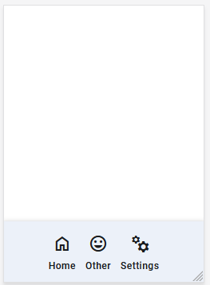

# polyfea-md-navigation-bar

This component renders navigation drawer, modeled after the [Material Design Navigation Bar](https://m3.material.io/components/navigation-bar/overview).

## How to Use

This web component is built with [StencilJS](https://stenciljs.com/), making it compatible with any framework or even without one. It's designed to be used as part of the [`polyfea-md-shell`](../polyfea-md-shell/readme.md) component and in combination with [polyfea-md-app](../polyfea-md-app/readme.md) component.

Import [@material/web](https://github.com/material-components/material-web#readme) and [theme tokens](https://m3.material.io/foundations/design-tokens/overview). For more details, refer to the examples in [polyfea-md-shell](../polyfea-md-shell/readme.md) documentation.

Import the component in your module:

```typescript
import '@polyfea/md-shell';
```

then place the element in your HTML.

```html
<div style="position: absolute; bottom: 0">
  <polyfea-md-navigation-bar>
    <polyfea-md-app href="./" headline="Home" 
      material-icon="home" context="rail-content"
    ></polyfea-md-app>
    <polyfea-md-app 
      href="./cool" headline="My other fea" short-headline="Other"
      material-icon="mood" context="rail-content">
    </polyfea-md-app>>
      <polyfea-md-app 
        href="./settings" headline="Settings" 
        material-icon="manufacturing" context="rail-content">
    </polyfea-md-app>
  </polyfea-md-rail>
</div>
```

It will render the following navigation rail:



## Specifications

<!-- Auto Generated Below -->


## Slots

| Slot | Description                                                                                                                     |
| ---- | ------------------------------------------------------------------------------------------------------------------------------- |
|      | renders the navigation actions.  Use [polyfea-md-app](../polyfea-md-app/readme.md) with attribute `context="navigation-content" |


## Dependencies

### Used by

 - [polyfea-md-shell](../polyfea-md-shell)

### Graph


----------------------------------------------

Polyfea MD Shell Web Components
