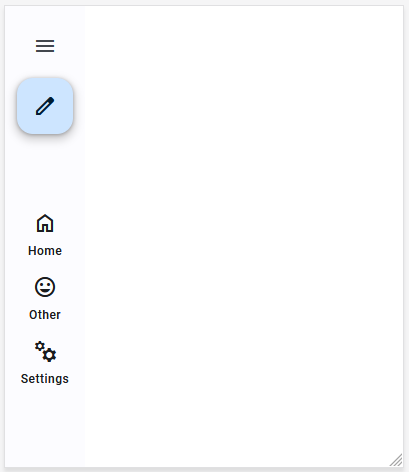
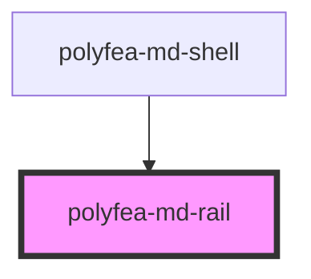

# polyfea-md-rail

This component renders navigation drawer, modeled after the [Material Design Navigation Rail](https://m3.material.io/components/navigation-rail/overview).

## How to Use

This web component is built with [StencilJS](https://stenciljs.com/), making it compatible with any framework or even without one. It's designed to be used as part of the [`polyfea-md-shell`](../polyfea-md-shell/readme.md) component and in combination with [polyfea-md-app](../polyfea-md-app/readme.md) component.

Import [@material/web](https://github.com/material-components/material-web#readme) and [theme tokens](https://m3.material.io/foundations/design-tokens/overview). For more details, refer to the examples in [polyfea-md-shell](../polyfea-md-shell/readme.md) documentation.

Import the component in your module:

```typescript
import '@polyfea/md-shell';
```

then place the element in your HTML.

```html
  <polyfea-md-rail content-position="middle">
    <md-fab slot="primary-action" variant="primary">
        <md-icon slot="icon">edit</md-icon>
      </md-fab>
    <polyfea-md-app href="./" headline="Home" 
      material-icon="home" context="rail-content"
    ></polyfea-md-app>
    <polyfea-md-app 
      href="./cool" headline="My other fea" short-headline="Other"
      material-icon="mood" context="rail-content">
    </polyfea-md-app>
    <polyfea-md-app 
        href="./settings" headline="Settings" 
        material-icon="manufacturing" context="rail-content">
    </polyfea-md-app>
  </polyfea-md-rail>
```

It will render the following navigation rail:



<!-- Auto Generated Below -->


## Properties

| Property          | Attribute          | Description                                                                      | Type                            | Default |
| ----------------- | ------------------ | -------------------------------------------------------------------------------- | ------------------------------- | ------- |
| `contentPosition` | `content-position` | The alignment of the navigation actions.                                         | `"bottom" \| "middle" \| "top"` | `'top'` |
| `drawerDisabled`  | `drawer-disabled`  | The rail show drawer open icon by default. Set this property to false to hide it | `boolean`                       | `false` |


## Events

| Event          | Description                                                                                                                                                                                                | Type               |
| -------------- | ---------------------------------------------------------------------------------------------------------------------------------------------------------------------------------------------------------- | ------------------ |
| `drawerOpened` | Raised when the drawer open icon is clicked indicating the user want to open the drawer. Drawer and rail are  mutually exclusive, the logic of showing one or other is controlled by the parent component. | `CustomEvent<any>` |


## Slots

| Slot               | Description                                                                                                                                                                                             |
| ------------------ | ------------------------------------------------------------------------------------------------------------------------------------------------------------------------------------------------------- |
|                    | This slot is for the main content of the rail, typically a list of navigation actions.  Use [polyfea-md-app](../polyfea-md-app/readme.md) with attribute `context="rail-content"                        |
| `"primary-action"` | This slot is for the [primary action's FAB](https://m3.material.io/components/navigation-rail/guidelines#3bdde9e4-7698-4dfb-9ffb-36285bca6329)  of the rail, and is depending on the application state. |


## Dependencies

### Used by

 - [polyfea-md-shell](../polyfea-md-shell)

### Graph


----------------------------------------------

Polyfea MD Shell Web Components
