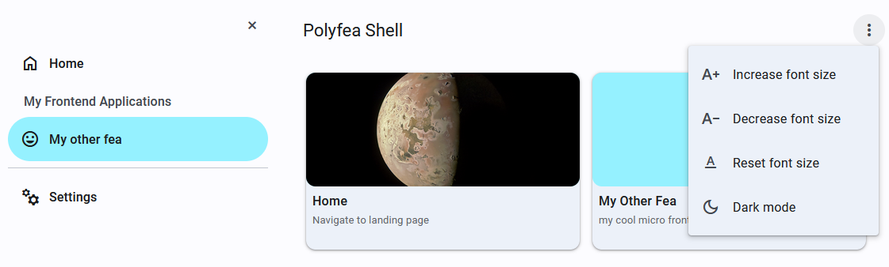
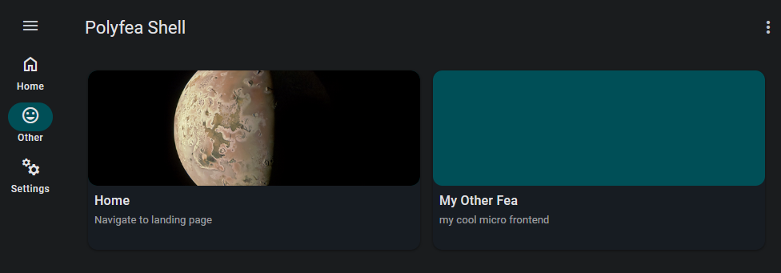
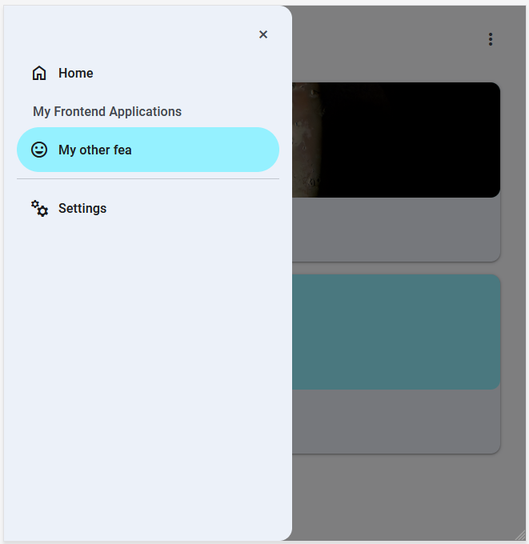
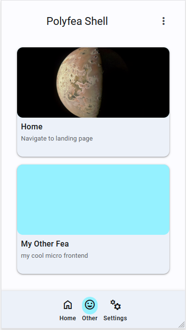
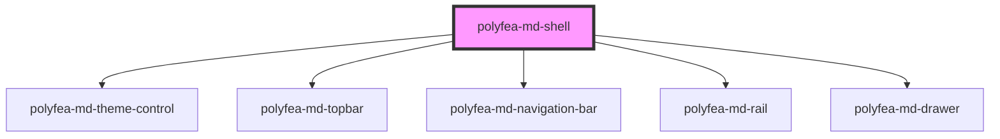

# polyfea-md-shell

This application shell is built according to the [Material Design Components](https://m3.material.io/components) specifications using [@material/web](https://github.com/material-components/material-web) elements.

While it can be used standalone, it's primarily designed for use with the [Polyfea Controller](https://github.com/polyfea/polyfea-controller) or the [@polyfea/core](https://github.com/polyfea/core) driver as a shell for microfrontend applications.

The shell's components adapt to the screen resolution. Here are examples:

* Large screens (desktop) default to a closeable navigation drawer on the side and a navigation rail when the drawer is closed.
  * Example with navigation drawer and topbar open:

    
  * Example with navigation drawer closed, dark theme:

    

* Medium screens (tablet, width < 52.5rem) display the navigation drawer as an overlay when open and the navigation rail when closed.
  * Example with navigation drawer overlay:

    

* Small screens (mobile, width < 37.5rem) display the navigation bar.
  * Example:

    

Use `drawer-disabled`, `rail-disabled`, and `navigation-disabled` properties to disable the navigation drawer, rail, and bar respectively. If both drawer and rail are disabled, the navigation bar shows by default. The top application bar is always visible.

## How to use

The shell can function as a standalone application or in conjunction with the [Polyfea Controller](https://github.com/polyfea/polyfea-controller) or [@polyfea/core](https://github.com/polyfea/core).

### With Polyfea Controller

Find sample Kubernetes custom resources and deployment manifests in the [`deploy/manifests`](../../../deploy/manifests/) folder.

### Standalone

For use outside the Polyfea ecosystem, import the material elements and theme styles manually.

Import the package:

```bash
npm i @polyfea/md-shell
```

In `index.html`, import the material elements, theme styles, and shell web components. The material elements are bundled in `material-all.mjs` for easy import.

```html
<html>
  <head>
  <base href="/">
  <title>Polyfea Shell</title>
  <meta name="viewport" content="width=device-width, initial-scale=1.0, minimum-scale=1.0, maximum-scale=5.0">

  <!-- assuming node_modules are served as static resources-->
  <link href="node_modules/@polyfea/md-shell/dist/md/fonts/material-symbols/style.css" async rel="stylesheet">
  <link href="node_modules/@polyfea/md-shell/dist/md/fonts/roboto/style.css" async rel="stylesheet">
  <link href="node_modules/@polyfea/md-shell/dist/md/theme/tokens.css" async  rel="stylesheet">
  <link href="node_modules/@polyfea/md-shell/dist/md/theme/theme.css" async  rel="stylesheet">
  <script src="node_modules/@polyfea/md-shell/dist/md/material-all.mjs" async type="module" ></script>
  <script src="node_modules/@polyfea/md-shell/dist/md-shell/md-shell.esm.js" async type="module" ></script>
</head>
```

In the body the element of your HTML, place the `polyfea-md-shell`element. Here is example for the samples shown above:

```html
<body>
  <polyfea-md-shell application-headline="Polyfea Shell">
    <!-- main content -->
    <polyfea-md-apps>
      <polyfea-md-app href="./" headline="Home" supporting-text="Navigate to landing page" material-icon="home"
        context="main-content" tile-img-src="https://images-assets.nasa.gov/image/PIA26234/PIA26234~orig.jpg">
      </polyfea-md-app>

      <polyfea-md-app href="./" headline="My Other Fea" supporting-text="my cool micro frontend" material-icon="home"
        context="main-content" disable-tile-img>
      </polyfea-md-app>
    </polyfea-md-apps>

    <!-- drawer -->
    <polyfea-md-app slot="drawer" href="./" headline="Home" supporting-text="Naviagte to landing page"
      material-icon="home" context="drawer-content"></polyfea-md-app>
    <polyfea-md-drawer-label slot="drawer" >My Frontend Applications</polyfea-md-drawer-label>
    <polyfea-md-app slot="drawer" href="./cool" headline="My other fea" supporting-text="My cool micro frontend"
      material-icon="mood" context="drawer-content">
    </polyfea-md-app>
    <md-divider slot="drawer"></md-divider>
    <polyfea-md-app slot="drawer" href="./settings" headline="Settings"
      supporting-text="Configure application parameters" material-icon="manufacturing" context="drawer-content">
    </polyfea-md-app>

    <!-- rail -->
    <md-fab slot="rail-primary-action" variant="primary">
      <md-icon slot="icon">edit</md-icon>
    </md-fab>
    <polyfea-md-app slot="rail" href="./" headline="Home" material-icon="home" context="rail-content"></polyfea-md-app>
    <polyfea-md-app href="./cool" slot="rail" headline="My other fea" short-headline="Other" material-icon="mood"
      context="rail-content">
    </polyfea-md-app>
    <polyfea-md-app slot="rail" href="./settings" headline="Settings" material-icon="manufacturing"
      context="rail-content">
    </polyfea-md-app>

    <!-- navigation bar -->
    <polyfea-md-app slot="navigation" href="./" headline="Home" material-icon="home"
      context="rail-content"></polyfea-md-app>
    <polyfea-md-app slot="navigation" href="./cool" headline="My other fea" short-headline="Other" material-icon="mood"
      context="rail-content">
    </polyfea-md-app>
    <polyfea-md-app slot="navigation" href="./settings" headline="Settings" material-icon="manufacturing"
      context="rail-content">
    </polyfea-md-app>

  </polyfea-md-shell>
</body>
```

### With Polyfea driver

This approach is useful for developing microfrontend applications intended for use with the Polyfea ecosystem, but in a standalone development environment. Instead of defining the shell in your HTML, you'll define a static configuration for the [@polyfea/core](https://github.com/polyfea/core) driver. This allows development with other microfrontends not yet ready for the Polyfea Controller, or when testing interactions between various microfrontend web components.

To start, import the package:

```bash
npm i @polyfea/md-shell
```

In your `index.html` import the [`@polyfea/core`](https://github.com/polyfea/core) driver and specify the static configuration for loading context area specification:

```html
<!DOCTYPE html>
<html dir="ltr" lang="en">
<head>
  <base href="/">
  <title>Polyfea Shell</title>
  <meta name="viewport" content="width=device-width, initial-scale=1.0, minimum-scale=1.0, maximum-scale=5.0">
  <meta name="polyfea-duplicit-custom-elements" content="verbose">
  <meta name="version" content="v1.0">
  <meta name="polyfea-backend" content="static://">´
  <!-- use latest version of the @polyfea/core -->
  <script type="module" src="https://cdn.jsdelivr.net/npm/@polyfea/core@1.0.1/dist/boot.mjs"></script>
  </head><body></body></head>
</html>
```

Your development server should serve a [`StaticConfig`](https://github.com/polyfea/browser-api/blob/main/docs/interfaces/StaticConfig.md) JSON from `./polyfea/static-config`. This should include the `shell` context and this package's microfrontend specification. See the sample configuration [here](../../assets/static-config-sample.jsonc).

```jsonc
{
  // we define three microfrontends here - material resources, the shell, and your package
  // The configuration assumes you serve node_modules as static resources
  "microfrontends": {
    "material-design": {
      // resources to load material elements and the theme
      "module": "node_modules/@polyfea/md-shell/dist/md/material-all.mjs",
      "resources": [
        {
          "kind": "stylesheet",
          "href": "node_modules/@polyfea/md-shell/dist/md/fonts/material-symbols/style.css"
        },
        {
          "kind": "stylesheet",
          "href": "node_modules/@polyfea/md-shell/dist/md/fonts/roboto/style.css"
        },
        {
          // by changing the token.css file, you can change the color scheme of the shell
          "kind": "stylesheet",
          "href": "node_modules/@polyfea/md-shell/dist/md/theme/tokens.css"
        },
        {
          "kind": "stylesheet",
          "href": "node_modules/@polyfea/md-shell/dist/md/theme/theme.css"
        }
      ]
    },
    "polyfea-md": {
      // the shell package
      "dependsOn": [
        "material-design"
      ],
      "module": "node_modules/@polyfea/md-shell/dist/md-shell/md-shell.esm.js"
    },
    "my-fea": {
      // your package
      ...
    }
  },
  "contextAreas": [
    {
      // the shell context area is provided by the boot driver. We use polyfe-md-shell
      // element, which will then bring in additional context area to fill
      "name": "shell",
      "contextArea": {
        "elements": [
          {
            "tagName": "polyfea-md-shell",
            "attributes": {
              "application-headline": "Polyfea Shell"
            },
            "microfrontend": "polyfea-md"
          }
        ]
      }
    },
    // below context areas are provided by the polyfea-md-shell
    {
      // on landing page - "/" path, we use polyfea-md-apps element
      // which will bring in context area `applications` (may be changed by attributes)
      "name": "main-content",
      "path": "^(\\.?/)?$",
      "contextArea": {
        "elements": [
          {
            "tagName": "polyfea-md-apps",
            "microfrontend": "polyfea-md"
          }
        ]
      }
    },
    ...
    {
      // list of applications to show on landing page
      // we use polyfea-md-app element to show the application tile
      // but you may use other elements e.g. to show dynamic content
      "name": "applications",
      "contextArea": {
        "elements": [
          {
            "microfrontend": "polyfea-md",
            "tagName": "polyfea-md-app",
            "attributes": {
              "headline": "My Fea App",
              "supporting": "The best app ever",
              "material-icon": "mood",
              "href": "./my-fea-area"
            }
          },
          ...
        ]
      }
    },
    {
      // list of elements to show in the navigation drawer. in case of 
      // Polyfea control you will specify context areas at webcomponent level
      // in static configuration it must be duplicated. Does not need to have 
      // the same list of elements as `applications context area` 
      "name": "drawer-content",
      "contextArea": {
        "elements": [
          ...
        ]
      }
    },
    ...
  ]
}
```

## Specifications

## Context Areas

| Context Area Name      | Elements shown | Description |
| -------------------    | ------------------ |------------ |
| `"drawer-content"`     | | Navigation drawer icons. Recommended: [polyfea-md-app](../polyfea-md-app/readme.md) elements.                                                                                                                            |
| `"main-content"`       | | The main content area of the page. For landing page, use [polyfea-md-apps](../polyfea-md-apps/readme.md) element.                                                                                                                  |
| `"navigation-content"` | 5 | The navigation bar icons. Recommended: [polyfea-md-app](../polyfea-md-app/readme.md) elements.                                                                                                                               |
| `"rail-content"`       | 7 |The navigation rail icons. Recommended: [polyfea-md-app](../polyfea-md-app/readme.md) elements.                                                                                                                              |
| `"rail-primary-action"` | 1 | The primary action of the rail. Recommended: Recommended: [md-fab](https://github.com/material-components/material-web/blob/main/docs/components/fab.md) elements.                                                                                                                              |
| `"topbar-leading-icon"`  | 1 | The leading icon of the top bar. Defaults to the drawer icon.                                                                                                         |
| `"topbar-menu-items"`     | | The top bar's menu items. Use [md-menu-item](https://github.com/material-components/material-web/blob/main/docs/components/menu.md#mdmenuitem-md-menu-item) for menu items. |
| `"topbar-trailing-icon"` | 1 |The trailing icon area of the top bar. Defaults to the menu icon. |

<!-- Auto Generated Below -->


## Properties

| Property              | Attribute               | Description                                                                                                               | Type                                           | Default           |
| --------------------- | ----------------------- | ------------------------------------------------------------------------------------------------------------------------- | ---------------------------------------------- | ----------------- |
| `applicationHeadline` | `application-headline`  | The name of the application displayed in the top bar. This is only shown  if the `app-shell-title` context area is empty. | `string`                                       | `'Polyfea Shell'` |
| `drawerCloseDisabled` | `drawer-close-disabled` | Determines whether the close button in the navigation drawer is hidden.                                                   | `boolean`                                      | `false`           |
| `drawerDisabled`      | `drawer-disabled`       | If set to true, the navigation drawer will be hidden in all screen resolutions.                                           | `boolean`                                      | `false`           |
| `navigationDisabled`  | `navigation-disabled`   | If set to true, the navigation bar will be hidden in all screen resolutions.                                              | `boolean`                                      | `false`           |
| `railDisabled`        | `rail-disabled`         | If set to true, the navigation rail will be hidden in all screen resolutions.                                             | `boolean`                                      | `false`           |
| `themeMenuDisabled`   | `theme-menu-disabled`   | Controls the visibility of the legibility buttons (font size adjustment, theme toggle) in the top bar menu.               | `boolean`                                      | `false`           |
| `topbarMoreDisabled`  | `topbar-more-disabled`  | If set to true, the menu button on the right side of the top bar will be hidden.                                          | `boolean`                                      | `false`           |
| `topbarVariant`       | `topbar-variant`        | Variant of the topbar. See [Top App Bar](https://m3.material.io/components/top-app-bar/overview) documentation.           | `"centered" \| "large" \| "medium" \| "small"` | `"centered"`      |


## Slots

| Slot                    | Description                                                                                                                                                                                                                                                                               |
| ----------------------- | ----------------------------------------------------------------------------------------------------------------------------------------------------------------------------------------------------------------------------------------------------------------------------------------- |
|                         | Place content in the main content area. For landing page, use [polyfea-md-apps](../polyfea-md-apps/readme.md) element. Overriden by `main-content` context area.                                                                                                                          |
| `"drawer"`              | Place content in the navigation drawer. Recommended: [polyfea-md-app](../polyfea-md-app/readme.md) elements. Overriden by `drawer-content` context area.                                                                                                                                  |
| `"navigation"`          | Place content in the navigation bar. Recommended: [polyfea-md-app](../polyfea-md-app/readme.md) elements. Overriden by `navigation-content` context area.                                                                                                                                 |
| `"rail"`                | Place content in the navigation rail. Recommended: [polyfea-md-app](../polyfea-md-app/readme.md) elements. Overriden by `rail-content` context area.                                                                                                                                      |
| `"rail-primary-action"` | Place content in the primary action area of the navigation rail. Recommended: [md-fab](https://github.com/material-components/material-web/blob/main/docs/components/fab.md) elements. Overriden by `rail-primary-actions` context area. Overriden by `rail-primary-action` context area. |
| `"topbar-leading"`      | Place content in the leading icon area of the top bar. Defaults to the drawer icon.  Overridden by `topbar-leading-icon` context area.                                                                                                                                                    |
| `"topbar-menu"`         | Place content in the top bar's menu area. Overridden by `topbar-menu-items` context area. Use [md-menu-item](https://github.com/material-components/material-web/blob/main/docs/components/menu.md#mdmenuitem-md-menu-item) for menu items.                                               |
| `"topbar-trailing"`     | Place content in the trailing icon area of the top bar. Defaults to the menu icon. Overridden by `topbar-trailing-icon` context area.                                                                                                                                                     |


## CSS Custom Properties

| Name             | Description                                                  |
| ---------------- | ------------------------------------------------------------ |
| `--drawer-width` | Sets the width of the navigation drawer. Default is 22.5rem. |
| `--rail-width`   | Sets the width of the navigation rail. Default is 5rem.      |


## Dependencies

### Depends on

- [polyfea-md-theme-control](../polyfea-md-theme-control)
- [polyfea-md-topbar](../polyfea-md-topbar)
- [polyfea-md-navigation-bar](../polyfea-md-navigation-bar)
- [polyfea-md-rail](../polyfea-md-rail)
- [polyfea-md-drawer](../polyfea-md-drawer)

### Graph


----------------------------------------------

Polyfea MD Shell Web Components
