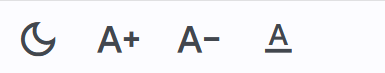
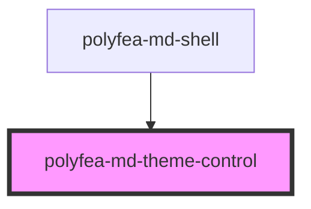

# polyfea-md-theme-control

Theme control component for Polyfea MD Shell. Controls the theme mode - light or dart, and the text size. Initially loads the theme mode and text size from the local storage or user preferences. The theme mode and text size are saved in the local storage when changed and reused on reload and next sessions.

## How to use

This web component is built with [StencilJS](https://stenciljs.com/), making it compatible with any framework or even without one. It's designed to be used as part of the [`polyfea-md-shell`](../polyfea-md-shell/readme.md) component and in combination with [polyfea-md-app](../polyfea-md-app/readme.md) component.

Import [@material/web](https://github.com/material-components/material-web#readme) and [theme tokens](https://m3.material.io/foundations/design-tokens/overview). For more details, refer to the examples in [polyfea-md-shell](../polyfea-md-shell/readme.md) documentation.

Import the component in your module:

```typescript
import '@polyfea/md-shell';
```

then place the element in your HTML.

```html
<polyfea-md-theme-control variant="preset"></polyfea-md-theme-control> <!-- load last saved state -->
<polyfea-md-theme-control variant="button" control="theme-toggle"></polyfea-md-theme-control> 
<polyfea-md-theme-control variant="button" control="text-increse"></polyfea-md-theme-control> 
<polyfea-md-theme-control variant="button" control="text-decrease"></polyfea-md-theme-control> 
<polyfea-md-theme-control variant="button" control="reset-font"></polyfea-md-theme-control> 
```

It will render following controls:


<!-- Auto Generated Below -->


## Properties

| Property  | Attribute | Description                                                                                                                                                                                                                                                                                                                                      | Type                                                                   | Default          |
| --------- | --------- | ------------------------------------------------------------------------------------------------------------------------------------------------------------------------------------------------------------------------------------------------------------------------------------------------------------------------------------------------ | ---------------------------------------------------------------------- | ---------------- |
| `control` | `control` | This property specifies which aspect of the theme is controlled by this element.                                                                                                                                                                                                                                                                 | `"reset-font" \| "text-decrease" \| "text-increase" \| "theme-toggle"` | `"theme-toggle"` |
| `variant` | `variant` | This property controls the display variant of the theme control. It can be used to render the control  as an icon button or a menu item.   The "preset" variant doesn't render anything but initializes the theme based on user preferences stored in local storage.  Include this in your document to ensure the theme is properly initialized. | `"button" \| "menu-item" \| "preset"`                                  | `"button"`       |


## Events

| Event          | Description                                                | Type                                                  |
| -------------- | ---------------------------------------------------------- | ----------------------------------------------------- |
| `themeChanged` | This event is fired when the theme is changed by the user. | `CustomEvent<{ name: ThemeMode; textSize: number; }>` |


## Slots

| Slot         | Description                                        |
| ------------ | -------------------------------------------------- |
| `"headline"` | menu item headline to replace the default headline |


## Dependencies

### Used by

 - [polyfea-md-shell](../polyfea-md-shell)

### Graph


----------------------------------------------

Polyfea MD Shell Web Components
