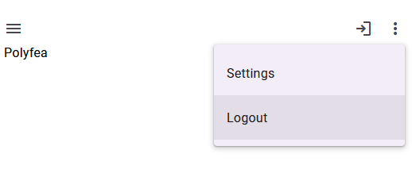
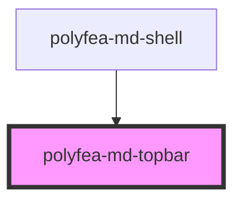

# polyfea-md-topbar

This component represents the top bar of the application, modeled after the [Material Design Top App Bar](https://m3.material.io/components/top-app-bar/overview).

## How to Use

This web component is built with [StencilJS](https://stenciljs.com/), making it compatible with any framework or even without one. It's designed to be used as part of the [`polyfea-md-shell`](../polyfea-md-shell/readme.md) component.

To use this component, install and import [@material/web](https://github.com/material-components/material-web#readme) and [theme tokens](https://m3.material.io/foundations/design-tokens/overview). For more details, refer to the examples in [polyfea-md-shell](../polyfea-md-shell/readme.md) documentation.

Import the component in your module:

```typescript
import '@polyfea/md-shell';
```

then place the element in your HTML.

```html
<polyfea-md-topbar variant="medium">
    <span slot="headline">Polyfea</span>
    <md-menu-item slot="menu">Settings</md-menu-item>
    <md-menu-item slot="menu">Logout</md-menu-item>    
    <md-button slot="trailing">
      <md-icon-button>
        <md-icon>login</md-icon>
      </md-icon-button>
    </md-button>
  </polyfea-md-topbar>
```

It will render the following medium top bar with a headline, a menu and a trailing button:



## Specification
<!-- Auto Generated Below -->


## Properties

| Property              | Attribute               | Description                                                                                                                                                                                                                                                                                                                                                                                                                                                                                                                                             | Type                                           | Default      |
| --------------------- | ----------------------- | ------------------------------------------------------------------------------------------------------------------------------------------------------------------------------------------------------------------------------------------------------------------------------------------------------------------------------------------------------------------------------------------------------------------------------------------------------------------------------------------------------------------------------------------------------- | ---------------------------------------------- | ------------ |
| `headline`            | `headline`              | Text of the headline                                                                                                                                                                                                                                                                                                                                                                                                                                                                                                                                    | `string`                                       | `"Polyfea"`  |
| `leadingIcon`         | `leading-icon`          | Icon to show in the leading position of the top bar if the `leading` slot is left empty. Possible values are: - `none` - No icon is shown. - `drawer` - A [menu](https://fonts.google.com/icons?icon.query=menu) icon is shown that opens the drawer. - `back` - A [back](arrow_back) icon is shown that emits a `back` event when clicked.                                                                                                                                                                                                             | `"back" \| "drawer" \| "none"`                 | `"drawer"`   |
| `moreActionsDisabled` | `more-actions-disabled` | Controls if right side icon with more actions menu is rendered                                                                                                                                                                                                                                                                                                                                                                                                                                                                                          | `boolean`                                      | `false`      |
| `variant`             | `variant`               | Variant of the applications top bar - changes the layout and size of the top bar. Possible values are: - `centered` - The top bar is centered and has a fixed height, only "more actions" menu or single trailing icon.  - `small` - The top bar has a fixed height and a menu and trailing icons. - `medium` - The top bar has a fixed height and a menu and trailing icons. Headline is bigger on separate line. - `large` - The top bar has a fixed height and a menu and trailing icons. Headline is bigger on separate line with wrapping enabled. | `"centered" \| "large" \| "medium" \| "small"` | `"centered"` |


## Events

| Event          | Description                                                                                                                                   | Type               |
| -------------- | --------------------------------------------------------------------------------------------------------------------------------------------- | ------------------ |
| `back`         | Emitted when clicking on the back leading icon button. The parent component shall set the `leading-icon` to `none` if there is no back action | `CustomEvent<any>` |
| `drawerOpened` | Emitted when clicking on the drawer leading icon button. The parent component shall set the `leading-icon` to `none` if the drawer is open    | `CustomEvent<any>` |


## Slots

| Slot         | Description                                                                                                           |
| ------------ | --------------------------------------------------------------------------------------------------------------------- |
| `"headline"` | The headline of the top bar. If not provided, the value of the `headline` property is shown.                          |
| `"leading"`  | The leading icon or button of the top bar. If not provided, the content is controlled by the `leading-icon` property. |
| `"menu"`     | The menu items of the "more actions" menu. Shall be elements of type `<md-menu-item>`.                                |
| `"trailing"` | The trailing actions - icons or buttons of the top bar,                                                               |


## Dependencies

### Used by

 - [polyfea-md-shell](../polyfea-md-shell)

### Graph


----------------------------------------------

Polyfea MD Shell Web Components
